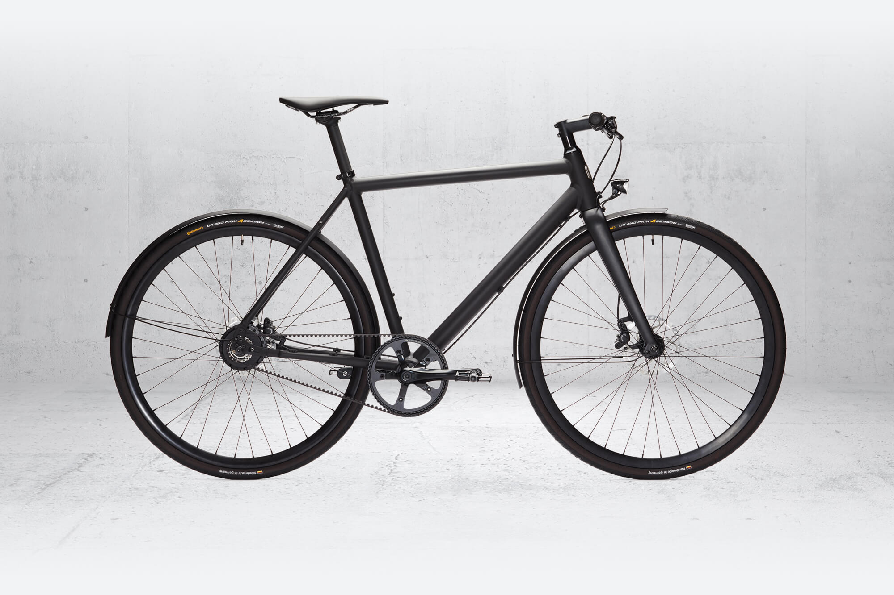
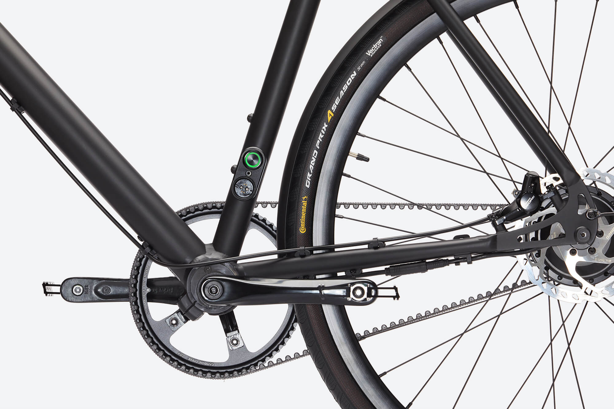

Investor and happy rider.

Ampler makes light e-bikes for urban commuters that look simply like beautiful, understated bycicles. All the electronics and batteries are hidden inside the frame.

I'm a huge fan of my single gear Curt (pictured below), that goes up to 70km with dynamic electric support up to 25 km/h.

The company is also [tradeable on Funderbeam](https://www.funderbeam.com/company/ampler-bikes).

