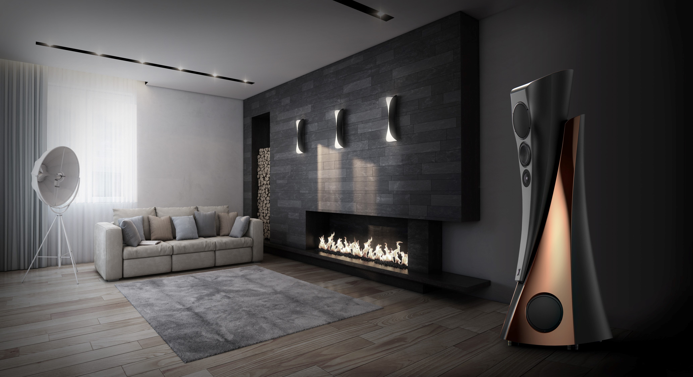

Seed investor.

Estelon is one of the world’s most luxurious speaker brands. It derives aesthetic and acoustic excellence through the merger of ingenious creativity and cutting-edge science. Each decision – from engineering techniques to materials and components used in the manufacturing process – is made with the perfect harmony of the speakers as a whole in mind.

Founded by Alfred Vassilkov, managed by Alissa Vassilkova.

Alfred had been designing speakers for other companies for over 25 years and spent many years researching opportunities to achieve his ambition. I had been his fan and customer since the [Audes Credo Blues](https://audes.ee/products/credo-loudspeakers/blues/) series of speakers he had designed. When he decided to start his own brand in 2010, I was honored to become their partner.

