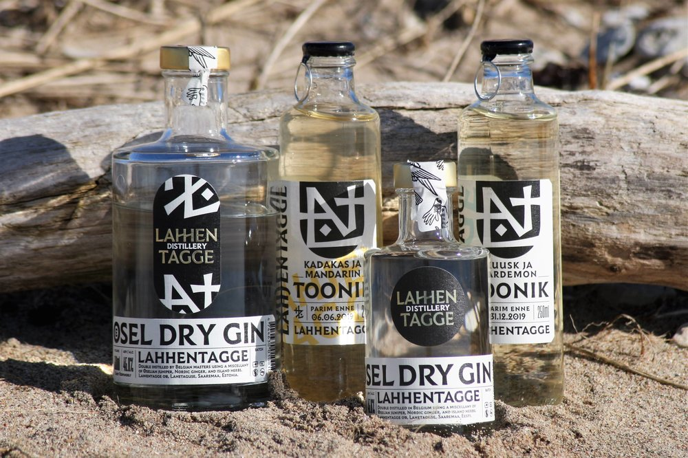

Investor and consumer.

Lahhentagge is a craft distillery of gin and tonic waters.

Lahhentagge drinks (Ösel Dry Gin, Lahjentagge tonics, Flaneur non-alcoholic gin) come from a land where the summers are warm and the winters are dark. Where tall forests cast long shadows over blooming pastures, and craggy juniper trees stand afoot fields of wind-licked wild grasses. Where endless stony beaches meet a swirling sea that brings winds and wild birds from distant lands. This is the island of Ösel (aka [Saaremaa](https://en.wikipedia.org/wiki/Saaremaa)) in the northern Baltic Sea.

Our distillery takes its name from our home village of Lahhentagge, birthplace of the great explorer Fabian Gottlieb von Bellingshausen (1778–1852). Bellingshausen discovered Antarctica and was the first Russian to circumnavigate the Earth.

