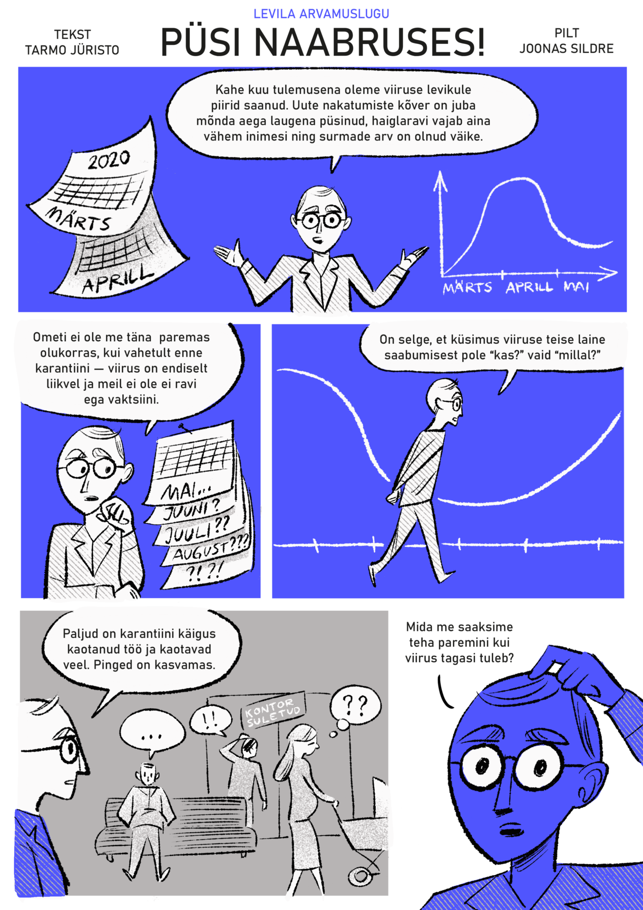

Seed investor.

Levila is an experimental media lab inventing the possible futures of journalism.

Founded by Daniel Vaarik.

To date, Levila has produced long form texts, investigate journalism research, original comic strips (from single frame cartoons to graphic novel illustrations), high end audio shows. The cast is a mix of professional actors, illustrators and engineers and fresh new faces and voices.

The content is published on Levila's own properties, syncidated and spread via experimental cross-overs on Instagram, Youtube, Twitter, Facebook, Soundcloud and other channels.

As an example, here's a visual opintion piece on preparation for possible next waves of COVID-19:

[
*Continue reading (in Estonian)...*](https://levila.ee/tekstid/enne-jargmist-lainet)