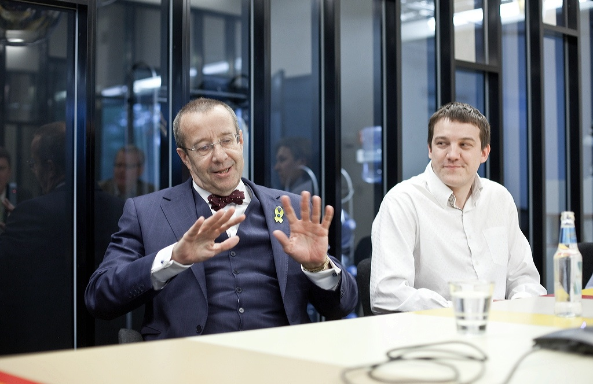

Advisor to President Ilves of Estonia.

 In 2009-12 I was honored to act as an advisor to [President Toomas Hendrik Ilves](https://vp2006-2016.president.ee/en/president/biography/index.html) on matters related to information technology, innovation and entrepreneurship.

Here's [the announcement at the time](https://vp2006-2016.president.ee/en/media/press-releases/1999-sten-tamkivi-head-of-skype-estonia-to-advise-the-president/index.html).

We have contnued collaboration on other projects since, most notably on [Estonia's Friends International Meeting](/project/efim).

